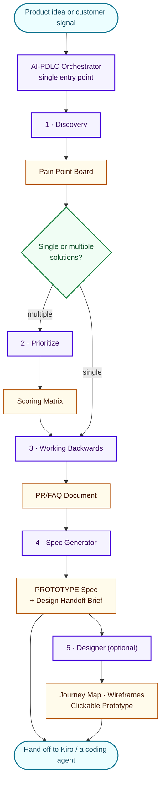

# AI-PDLC — AI-Driven Product Development Lifecycle

[](./LICENSE)

A methodology and agent suite for **Amazon Quick** that takes product teams from customer insight to build-ready specs — in hours, not months.

Download this repo, install the six agent definitions into your Amazon Quick workspace, and run a guided conversation that produces real artifacts: a pain point board, a prioritization matrix, an Amazon-style PR/FAQ, a prototype spec, and clickable design deliverables.

> [!IMPORTANT]
> Generative AI can make mistakes. You should consider reviewing all output and costs generated by your chosen AI model and agentic assistant. See [AWS Responsible AI Policy](https://aws.amazon.com/ai/responsible-ai/policy/).

## 🎥 Video

See AI-PDLC in action — how product teams go from customer insight to a build-ready spec using Amazon Quick agents, then hand off to Kiro for implementation.

<p align="center">
  <a href="https://www.youtube.com/watch?v=lwYwAgdklYw&t=2158s"></a>
</p>

## What Is AI-PDLC?

AI-PDLC is a structured, AI-native methodology for **product teams** (PMs, BAs, PgMs, Designers). It provides:
- A defined lifecycle: **Discover → Decide → Design → Prototype**
- 6 AI agents that guide teams through each phase
- A shared audit trail for governance and traceability
- A clean handoff to engineering via ACP (Agent Client Protocol)

> [!TIP]
> New to AI-PDLC, or sharing it with a product team? Start with the **[AI-PDLC Overview](./docs/AI-PDLC-Overview.md)** — a short guide covering what the process is, what Amazon Quick brings, and what a run actually feels like for PMs, BAs, PgMs, and Designers.

## How AI-PDLC Relates to AI-DLC

AI-PDLC covers the **product** half of the lifecycle — deciding *what* to build and why. [AI-DLC](https://github.com/awslabs/aidlc-workflows) (AI-Driven Development Life Cycle) covers the **engineering** half — turning an approved spec into working, tested software.

| | AI-PDLC (this repo) | [AI-DLC Workflows](https://github.com/awslabs/aidlc-workflows) |
|---|---|---|
| **Question** | What should we build, and why? | How do we build and ship it? |
| **Audience** | PMs, BAs, PgMs, Designers | Engineers |
| **Runs on** | Amazon Quick agents | Kiro, Claude Code, Cursor, Codex CLI, and other harnesses |
| **Produces** | Pain point board, scoring matrix, PR/FAQ, prototype spec, design artifacts | Architecture, code, tests, deployment |

The two compose: AI-PDLC's **PROTOTYPE Spec** is the input an engineering agent needs to start building. Run AI-PDLC first, then hand the spec to Kiro or an AI-DLC workflow.

## How It All Comes Together

Enterprise knowledge → AI-PDLC agents on Amazon Quick → the spec → coding agents → human gates. Grounded end to end, and nobody switches tools.

<p align="center">
  
</p>

**The Brain · The Common Language · The Hands.** AI-PDLC agents do the thinking and produce the spec. The spec is the one artifact both lifecycles share. Coding agents are the hands that build and review against it. A human approves at every gate.

### Why the spec is the common language

`prototype_spec.md` is a contract read by three different audiences:

| Reader | Uses the spec as |
|---|---|
| **Product team** (PMs, BAs, PgMs, Designers) | The decision record — every requirement traces back to a customer signal |
| **Build agent** (Kiro, Claude Code) | The build contract — acceptance criteria to implement against |
| **Review agent** | The review rubric — the same criteria, audited independently |

One agent builds to the spec; another reviews against the same acceptance criteria — like an author and a reviewer working from one contract in two distinct roles.

## Architecture

<details>
<summary>Text version of the agent architecture</summary>

```
┌─────────────────────────────────────────────────────────────────────────────────┐
│  AI-PDLC AGENTS (Amazon Quick)                                                  │
│                                                                                 │
│  ┌───────────────────────────────────────────────────────────────────────────┐  │
│  │  ORCHESTRATOR — Single Entry Point | Dynamic Q&A | Delegates Headless     │  │
│  └───────────────────────────────────────────────────────────────────────────┘  │
│                                                                                 │
│  ┌─────────────┐ ┌────────────┐ ┌────────────────────┐ ┌──────────┐ ┌────────┐│
│  │  Discovery  │ │ Prioritize │ │ Working Backwards  │ │ Spec Gen │ │Designer││
│  └─────────────┘ └────────────┘ └────────────────────┘ └──────────┘ └────────┘│
│                                                                                 │
└─────────────────────────────────────────────────────────────────────────────────┘
                                      │
                                      │ ACP (Agent Client Protocol)
                                      ▼
                    ┌────────────────────────────────────────┐
                    │  KIRO / Coding Agent                    │
                    │  (Engineer → Ship → Operate → Learn)    │
                    └────────────────────────────────────────┘
```

</details>

A higher-resolution reference architecture is available in [`architecture/`](./architecture/) as both SVG (viewable) and Excalidraw (editable).

## Agent Pipeline

| # | Agent | Produces | Receives From |
|---|-------|----------|---------------|
| 0 | **Orchestrator** | (manages pipeline) | User |
| 1 | **Discovery** | Pain Point Board | Entry point |
| 2 | **Prioritize** | Scoring Matrix | Discovery (if multiple solutions) |
| 3 | **Working Backwards** | PR/FAQ Document | Prioritize or Discovery |
| 4 | **Spec Generator** | PROTOTYPE Spec + Design Handoff Brief | Working Backwards |
| 5 | **Designer** (optional) | Journey Map + Wireframes + Prototype | Spec Generator |

**Single solution path:** Discovery → Working Backwards → Spec Generator → Designer  
**Multiple solutions path:** Discovery → Prioritize → Working Backwards → Spec Generator → Designer

### The flow, stage by stage

Each stage asks its questions, pauses at a gate for your approval, then produces one artifact that seeds the next stage.



Every artifact is written to your Quick Space alongside a shared `audit.md`, so the reasoning behind each decision stays traceable.

## Prerequisites

- **Amazon Quick** (Desktop or Web) with access to create agents
- **A Quick Space** for artifact storage — the agents read from and write artifacts to this space
- Permission to create custom agents in your workspace

No build step, runtime, or package installation is required. This repository contains agent definitions (prompts), not application code.

## Getting Started

### 1. Get the repo

```bash
git clone https://github.com/aws-samples/quick-aipdlc.git
cd quick-aipdlc
```

Or download the ZIP from GitHub and extract it.

### 2. Create a Quick Space

In Amazon Quick, create a Space (for example `MyProduct-v1`). The agents will store every artifact and the shared `audit.md` here. You'll be asked for the space name at the start of each session.

### 3. Create the 5 specialist agents

Open [`agents/ai_pdlc_agents_full.json`](./agents/ai_pdlc_agents_full.json) — this is the source of truth. For each of the 5 specialist agents (Discovery, Prioritize, Working Backwards, Spec Generator, Designer):

1. In Quick, go to **Agent Picker → Create Agent**
2. Copy the agent's `name` exactly as it appears in the JSON — for example `AI-PDLC Discovery`
3. Paste the `instructions`, `description`, `welcome_message`, and `starter_prompts` fields
4. Save

> [!WARNING]
> **Names matter.** The Orchestrator finds specialists at runtime by searching for their names (`AI-PDLC Discovery`, `AI-PDLC Prioritize`, etc.). If you rename an agent, the Orchestrator won't find it.

If you'd rather read the instructions in a friendlier format before pasting, each agent also has a standalone Markdown file in [`agents/`](./agents/).

### 4. Create the Orchestrator last

Create `AI-PDLC Orchestrator` the same way, using [`agents/orchestrator.md`](./agents/orchestrator.md) or the Orchestrator entry in the JSON.

It discovers specialists dynamically at runtime (via `find_relevant_chat_agents`), so there are **no agent IDs to configure** — the setup is portable across any workspace.

### 5. Run the workflow

Select **AI-PDLC Orchestrator** from the agent picker and say:

```
Run the full AI-PDLC pipeline
```

The Orchestrator will ask a short setup round (participant name, space name, any existing inputs, pace, and scope), then walk you stage by stage. At each stage it asks the specialist's questions in chat, pauses at a gate for your approval, generates the artifact, and saves it to your space.

You can also start narrower — for example: `I need a PR/FAQ for a product idea` or `Help me discover customer pain points`.

## Two Usage Modes

Same agents, same artifacts — two ways in. Talk to a single specialist when you need one thing, or let the Orchestrator run the whole pipeline.

<p align="center">
  
</p>

| Mode | How | Best For |
|------|-----|----------|
| **Orchestrated** | User talks only to Orchestrator → it reads specialist frameworks, asks questions, delegates headless | Full pipeline runs, workshops |
| **Standalone** | User picks a specialist directly from the agent picker → full interactive Q&A | Single-stage work, testing individual agents |

**The difference that matters:** in standalone mode the specialist asks you its own questions. In orchestrated mode the Orchestrator reads those same questions out of the specialist at runtime and asks them itself — then hands the specialist a pre-filled brief with `ALL Q&A has been completed by the orchestrator — DO NOT ask any questions`, which is what puts it in headless mode. The questions never get asked twice, and you never switch agents.

## What You Get — Example Output

The [`outputs/`](./outputs/) folder contains a complete worked example: a fictional healthcare product (*AnyCompany ClinicalFlow™*) run end-to-end through every stage.

| Artifact | Produced By |
|----------|-------------|
| [`DISCOVERY-pain-point-board.md`](./outputs/DISCOVERY-pain-point-board.md) | Discovery |
| [`PRIORITIZE-scoring-matrix.md`](./outputs/PRIORITIZE-scoring-matrix.md) | Prioritize |
| [`WORKING-BACKWARDS-prfaq.md`](./outputs/WORKING-BACKWARDS-prfaq.md) | Working Backwards |
| [`SPEC-GENERATOR-prototype-spec.md`](./outputs/SPEC-GENERATOR-prototype-spec.md) | Spec Generator |
| [`DESIGNER-user-journey-map.html`](./outputs/DESIGNER-user-journey-map.html), [`DESIGNER-wireframes.html`](./outputs/DESIGNER-wireframes.html), [`DESIGNER-prototype.html`](./outputs/DESIGNER-prototype.html) | Designer |
| [`audit.md`](./outputs/audit.md) | All agents (shared trail) |

Open the three `DESIGNER-*.html` files in a browser to see the generated journey map, wireframes, and clickable prototype.

## Folder Structure

```
quick-aipdlc/
├── README.md                     ← You are here
├── LICENSE                       ← MIT
├── CONTRIBUTING.md
├── CODE_OF_CONDUCT.md
├── agents/                       ← Agent definitions (the installable package)
│   ├── ai_pdlc_agents_full.json  ← Complete build package (source of truth)
│   ├── ai_pdlc_agent_configs.json← Structural reference
│   ├── orchestrator.md           ← Orchestrator instructions
│   ├── discovery.md              ← Discovery instructions
│   ├── prioritize.md             ← Prioritize instructions
│   ├── working_backwards.md      ← Working Backwards instructions
│   ├── spec_generator.md         ← Spec Generator instructions
│   └── designer.md               ← Designer instructions
├── outputs/                      ← Complete worked example (sample artifacts)
├── docs/                         ← Narrative & positioning
│   ├── AI-PDLC-Overview.md       ← 3-page explainer for product teams
│   └── script/                   ← Walkthrough scripts
├── architecture/                 ← Diagrams
│   ├── ai_pdlc_end_to_end_flow.svg        ← End-to-end flow (in README)
│   ├── ai_pdlc_usage_modes.svg            ← Standalone vs orchestrated (in README)
│   ├── ai_pdlc_humans_and_agents.svg      ← Who does what, per stage
│   ├── ai_pdlc_reference_architecture.svg ← Reference architecture (viewable)
│   └── ai_pdlc_reference_architecture.excalidraw ← Editable source
```

## About the Agent Files

| File | Purpose | Use When |
|------|---------|----------|
| `agents/ai_pdlc_agents_full.json` | **Source of truth.** Contains all 6 agents with complete instructions, descriptions, welcome messages, and starter prompts. | Setting up agents in a new workspace — copy instructions from here. |
| `agents/ai_pdlc_agent_configs.json` | Structural overview — pipeline flow, scoring frameworks, handoff logic. Does NOT contain full instructions. | Understanding the architecture at a glance without reading the full prompts. |
| `agents/*.md` (individual files) | **Human-readable reference** — one file per agent, easy to scan and review. Same content as the JSON but formatted for reading. | Reviewing a specific agent's behavior, understanding what it does, making edits before applying. |

**TL;DR:** Use the JSON to build. Use the `.md` files to read and review.

## Key Design Decisions

- **Agents, not skills** — AI-PDLC is conversational (requires human judgment at every gate), so agents are the right vehicle
- **Orchestrator pattern** — User talks to one agent; it reads specialist frameworks dynamically (no question duplication)
- **Headless mode** — Specialists skip Q&A when invoked by the Orchestrator (context is pre-filled)
- **Belt & suspenders audit** — Specialists generate audit entries in their output; Orchestrator validates and uploads to `audit.md`
- **Dynamic lookup** — Orchestrator finds specialists by name (portable across any workspace)
- **Two Q&A modes** — Deep Discovery (8-12 questions/phase) vs Fast Track (3-5 + AI suggestions)
- **Interactive Chat Guard** — When used standalone, agents always ask questions first (never skip to generation)
- **No hardcoded values** — Space name and participant identity are asked at Phase 0

## Troubleshooting

| Symptom | Fix |
|---------|-----|
| Orchestrator says it can't find a specialist | Agent names must match the JSON exactly (e.g. `AI-PDLC Discovery`). Recreate or rename the agent. |
| Agent skips straight to generating an artifact | You may be in a delegated/headless context. Start a fresh session with the Orchestrator, or invoke the specialist directly for interactive Q&A. |
| Artifacts aren't appearing | Confirm the Space name you gave at Phase 0 matches an existing Quick Space you can write to. |
| `audit.md` is missing entries | The Orchestrator creates and appends it per stage. Ask it to "validate the audit log" to backfill. |

## References

- [AI-PDLC Overview](./docs/AI-PDLC-Overview.md) — what the process is, what Amazon Quick brings, and what a run feels like (start here)
- [Video: AI-Driven Product Development with Amazon Quick and Kiro](https://www.youtube.com/watch?v=lwYwAgdklYw&t=2158s)
- [AWS Responsible AI Policy](https://aws.amazon.com/ai/responsible-ai/policy/)

<!-- TODO: add links to the published AI-PDLC blog posts once live. -->

## Authors

AI-PDLC was created by:

- **Anupa Bhattacharyya**
- **Debaprasun Chakraborty**
- **Vishnu Elangovan**

## Contributing

Contributions are welcome. See [CONTRIBUTING.md](./CONTRIBUTING.md) for guidelines.

When editing agents: update the `.md` file, then mirror the change into `agents/ai_pdlc_agents_full.json`. The JSON is the source of truth for builds; the `.md` files are human-readable references.

## Security

If you discover a potential security issue, please follow the [AWS vulnerability reporting process](http://aws.amazon.com/security/vulnerability-reporting/). Do not create a public GitHub issue.

## License

This project is licensed under the MIT License — see the [LICENSE](./LICENSE) file for details.

---

*Sample artifacts in this repository use fictional companies and personas. `AnyCompany` is a placeholder name used in AWS documentation and samples.*
