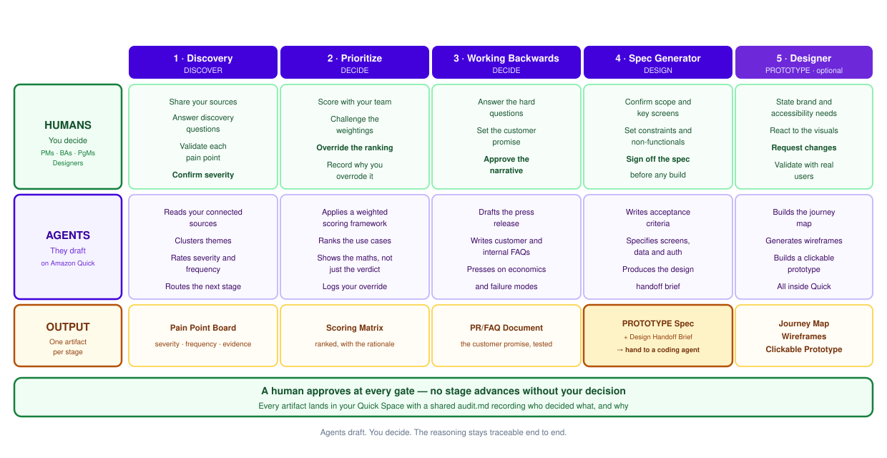
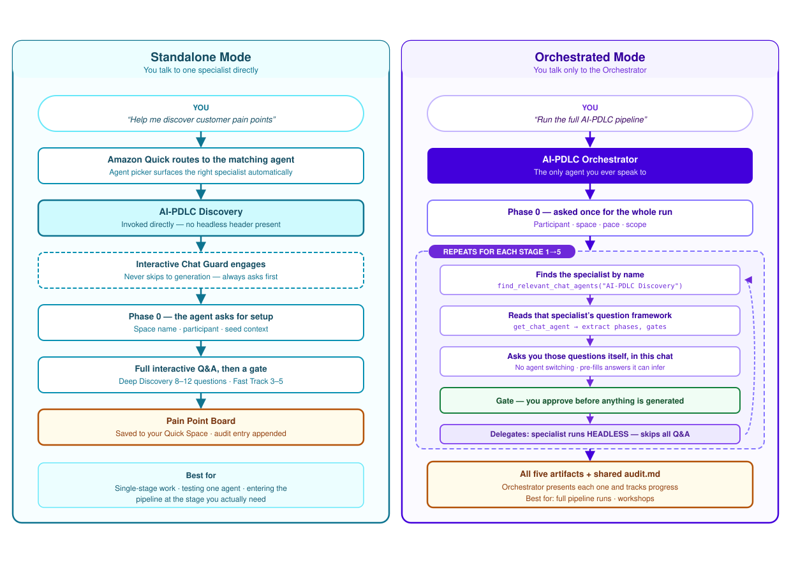
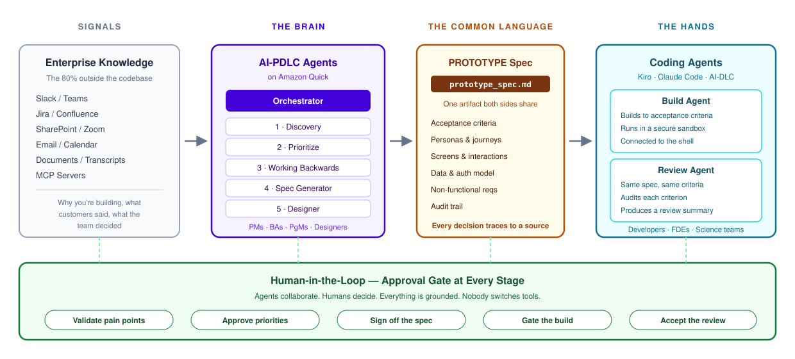

# AI-PDLC — How Product Teams Work With Agents

**A short guide for Product Managers, Business Analysts, Program Managers, and Designers.**

AI-PDLC is a way of running the front half of product development — from customer signal to build-ready spec — as a guided conversation with AI agents, where a human approves every decision. It runs on **Amazon Quick**, using six agents you install into your own workspace.

This guide explains what the process is, what Amazon Quick brings to it, and what a run actually feels like.

---

## The problem it solves

Getting from "customers are unhappy about something" to "engineering can start building" is mostly coordination work, and it goes wrong in predictable ways:

- **The context is scattered.** The reasons behind a product decision live in Slack threads, meeting recordings, tickets, and documents — not in any single place a team can reason over.
- **The reasoning gets lost.** A decision gets made in a meeting, but six weeks later nobody can reconstruct *why* that option won, or what evidence supported it.
- **The handoff is lossy.** Engineering receives a document that omits the acceptance criteria, the personas, or the constraint that mattered most.
- **The good practices get skipped under time pressure.** Working Backwards, weighted prioritization, and traceability are the first things to go when a deadline approaches.

AI-PDLC addresses these by making the process itself agent-guided: the structure is enforced by the agents, the context comes from your connected enterprise knowledge, and every decision is recorded as it happens.

---

## What Amazon Quick brings

Amazon Quick is the platform the agents run on. Four of its capabilities do the heavy lifting:

| Capability | Why it matters here |
|---|---|
| **Connected enterprise knowledge** | Quick connects to the tools your team already works in — chat, tickets, wikis, document stores, meeting content. Agents can ground their questions and outputs in what your organization actually said, rather than starting from a blank prompt. |
| **Spaces** | A Space is a shared working folder for a project. Every artifact and the shared `audit.md` are written there, so the whole team reads from one place. |
| **Custom agents** | You define an agent with instructions, a description, and starter prompts. AI-PDLC is simply six such agents — there is no application to deploy. |
| **Agent-to-agent delegation** | An agent can find another agent by name at runtime and hand it a background task. This is what lets one Orchestrator run a five-stage pipeline without you switching agents. |

Because the agents are just prompt definitions, the whole method is portable: install them in any Quick workspace and they work, with no IDs to configure.

---

## The lifecycle

Four phases, five specialist agents, one Orchestrator that runs the pipeline.

**Discover → Decide → Design → Prototype**

| Stage | Agent | Produces |
|---|---|---|
| Discover | **Discovery** | Pain Point Board |
| Decide | **Prioritize** | Scoring Matrix |
| Decide | **Working Backwards** | PR/FAQ Document |
| Design | **Spec Generator** | PROTOTYPE Spec + Design Handoff Brief |
| Prototype | **Designer** *(optional)* | Journey Map, Wireframes, Clickable Prototype |

If Discovery surfaces only one credible solution, the pipeline skips Prioritize and goes straight to Working Backwards.

---

## How the work divides between humans and agents

This is the part worth internalizing: **agents draft, humans decide.** The agent does the assembling, structuring, and writing. You supply judgment, context the agent cannot know, and approval.

Nothing advances without a human decision. Every stage ends at a gate where you approve, revise, or send the agent back.

---

## What a run feels like

A worked example, with a Product Manager driving and a Business Analyst and Designer joining at the stages where they matter.

**Setup (about two minutes).** The PM opens the Orchestrator and says *"Run the full AI-PDLC pipeline."* The Orchestrator asks five setup questions: who is in the session, which Space to use, whether there is existing input to start from, what pace to work at (thorough or fast), and whether to run the whole pipeline or a single stage.

**Discover.** The Orchestrator asks the Discovery agent's questions — target customers, what they struggle with, current workarounds, how severe and how frequent. The BA pastes in what support tickets and interview notes are saying. The agent clusters the signals into themes, rates severity and frequency, and shows a draft Pain Point Board. The PM corrects two severity ratings and adds a regulatory constraint the agent had no way of knowing. **Gate: the team approves.**

**Decide.** Several solution directions emerged, so the pipeline routes through Prioritize. The agent applies a weighted scoring framework and ranks the options, showing the score for each criterion rather than just the verdict. The team disagrees with the top pick — two options are complementary and stronger together. They override the ranking, and the agent records the override and the stated reason. **Gate: approved, with the override logged.**

Then Working Backwards. The agent drafts a press release written from the customer's point of view, plus customer-facing and internal FAQs that press on unit economics, failure modes, and what must be true for this to work. The PM rewrites the headline. **Gate: approved.**

**Design.** The Spec Generator turns the approved narrative into a PROTOTYPE Spec: personas, key screens, interaction detail, data and auth model, non-functional requirements, and acceptance criteria — plus a Design Handoff Brief. The Designer joins and states brand and accessibility requirements. **Gate: the PM signs off before anything gets built.**

**Prototype.** The Designer agent generates a journey map, wireframes, and a clickable prototype, all inside Quick. The team clicks through it in the same session and requests two changes.

**Handoff.** The spec goes to a coding agent such as Kiro. One agent builds against the acceptance criteria; another reviews against those same criteria. A human still approves.

Throughout, every artifact and every gate approval has been written to the Space and recorded in `audit.md` — so the reasoning is reconstructable months later.

---

## Two ways to work

You do not have to run the whole pipeline. Ask a specialist directly and Amazon Quick routes you to the right agent, which then runs its own full interview. Or talk only to the Orchestrator and let it drive all five stages.

The difference is only *who asks the questions*. In orchestrated mode the Orchestrator reads each specialist's question framework at runtime and asks those questions itself, then hands the specialist a pre-filled brief. You are never asked the same question twice, and you never switch agents mid-session.

---

## Where it hands off

`prototype_spec.md` is the one artifact both halves of the lifecycle share. AI-PDLC decides *what* to build and why; engineering agents build it.

The same file is read three ways: as a decision record by the product team, as a build contract by the build agent, and as a review rubric by the review agent.

---

## Why this is worth adopting

- **The structure holds under deadline pressure.** Working Backwards and weighted prioritization happen because the agents ask for them, not because someone remembered to.
- **Decisions carry their reasoning.** `audit.md` records who decided what, on what evidence, at every gate — including overrides.
- **The handoff stops being lossy.** Engineering receives acceptance criteria, not prose.
- **Nobody changes tools.** The work happens in one conversation, grounded in knowledge your organization already has.
- **Humans stay accountable.** The agents never decide. They draft, and a person approves.

---

## Getting started

1. Create a Space in Amazon Quick for your project.
2. Create the five specialist agents from [`agents/ai_pdlc_agents_full.json`](../agents/ai_pdlc_agents_full.json), using each agent's `name` exactly as written.
3. Create the Orchestrator last.
4. Select the Orchestrator and say *"Run the full AI-PDLC pipeline."*

Full setup instructions are in the [README](../README.md). A complete worked example — every artifact from a fictional healthcare product run end to end — is in [`outputs/`](../outputs/).

---

> Generative AI can make mistakes. Review all output and costs generated by your chosen AI model and agentic assistant. See the [AWS Responsible AI Policy](https://aws.amazon.com/ai/responsible-ai/policy/).

*Examples in this repository use fictional companies and personas. `AnyCompany` is a placeholder name used in AWS documentation and samples.*
